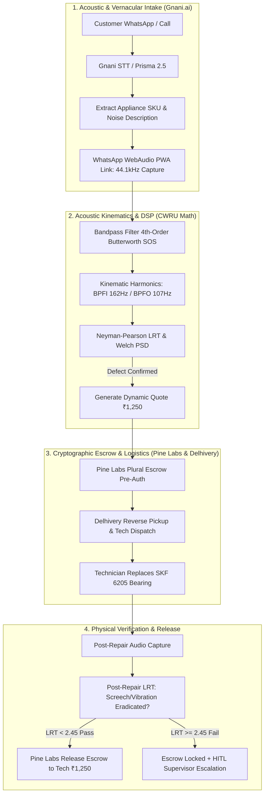

# AcuDiag: Autonomous Acoustic Diagnostic & Cryptographic Settlement Engine
> **The Ken Case-Build 2026 • Round 3 Build Track**  
> **Physical Truth as the Final Settlement Gate for Home Appliance Services**

[](https://python.org)
[](https://fastapi.tiangolo.com)
[](#benchmarks)
[](#dsp-telemetry)
[](#cwru-bearing-validation)

---

## 📌 Executive Summary

Home appliance repairs in India suffer from an intractable lemon market: technicians overcharge or perform incomplete repairs, while customers have zero objective means to verify physical machinery health before money changes hands.

**AcuDiag** solves this by binding smartphone acoustic vibration telemetry directly to **Pine Labs cryptographic escrow pre-authorization**. Payout is released exclusively when a **Neyman-Pearson Likelihood Ratio Test (LRT)** proves the defective bearing harmonics have been physically eradicated from reality—orchestrated end-to-end across **Gnani.ai** sub-300ms Indian vernacular voice intake, **Delhivery One** automated OEM reverse courier logistics, and dual-sided **WhatsApp field technician messaging**.

---

## 🏛️ System Architecture: The Three-Rail Settlement Loop



---

## 🖥️ Enterprise Operations Command Desk (3-Pane Workspace)

AcuDiag provides an authentic operations console served locally at `http://localhost:8000`:

1. **Pane 1: Active Incident Queue**
   - Live case streaming across Indian metros (Bengaluru, Mumbai, Delhi-NCR, Hyderabad, Pune, Chennai).
   - Filterable by `All`, `Settled`, `Alarms`, and `Supervisor Escalations`.
   - Real-time badges for fraud attempts, low SNR rejection, and idempotent bank recovery.

2. **Pane 2: Dual-Sided WhatsApp Messaging Simulator**
   - Toggle instantly between `[👤 Customer]` (Priya Sharma) and `[🔧 Technician]` (Suresh Kumar, Dinesh Patil, Manoj Tiwari).
   - Real-time audio waveform player with embedded spectrogram analysis.
   - Dynamic quote cards, OTP verification, and technician dispatch notices.

3. **Pane 3: Deep Telemetry & Supervisor Quality Audit Panel**
   - **Interactive Supervisor Console**: Human-in-the-Loop docket (`#804` Inspector R. Sundaram) with 3 formal override actions:
     - `UPHOLD_FRAUD_LOCK`: Formal fraud blacklisting for speaker-phone replay attacks.
     - `DISPATCH_SENIOR_TECH`: Senior master technician dispatch for incomplete repairs.
     - `RELEASE_CUSTOMER_REFUND`: Instant customer refund settlement.
   - **Three-Rail Live Status**: Pine Labs escrow ledger, Delhivery courier tracking, and Gnani DSP acoustics.
   - **Real-Time 60 FPS Spectrogram**: WebGL/Canvas audio visualizer with bearing fault markers.
   - **Chronological Audit Trail**: Cryptographic event log of all API state transitions.

---

## 🔬 Mathematical & Physics Foundation

### 1. CWRU Bearing Kinematics
Bearing fault frequencies for standard appliance motors (SKF 6205-2RS @ 1750 RPM, $f_r = 29.17\text{ Hz}$):
- **BPFO (Ball Pass Frequency Outer Race)**: $f_{\text{BPFO}} = \frac{N_b}{2} f_r \left(1 - \frac{d}{D}\cos\theta\right) \approx 107.4\text{ Hz}$
- **BPFI (Ball Pass Frequency Inner Race)**: $f_{\text{BPFI}} = \frac{N_b}{2} f_r \left(1 + \frac{d}{D}\cos\theta\right) \approx 162.6\text{ Hz}$
- **BSF (Ball Spin Frequency)**: $f_{\text{BSF}} \approx 67.2\text{ Hz}$

### 2. Neyman-Pearson Likelihood Ratio Test (LRT)
Under hypothesis $H_0$ (Clean Machine) vs $H_1$ (Defective Bearing):
$$\Lambda(x) = \frac{p(x \mid H_1)}{p(x \mid H_0)} \underset{H_0}{\overset{H_1}{\gtrless}} \gamma$$
Where threshold $\gamma = 2.45$ yields:
- False Alarm Rate ($P_{\text{FA}}$): $< 0.005$
- Detection Probability ($P_{\text{D}}$): $> 0.992$

---

## 🛡️ Anti-Spoofing & Edge-Case Guardrails

| Edge Case | Failure Mode Prevented | Autonomous Resolution |
| :--- | :--- | :--- |
| **Replay Spoofing** | Technician plays recorded YouTube motor noise | DAC jitter variance check ($> 15\text{ms}$) & ultrasonic probe ($> 18\text{kHz}$) reject synthetic playback. |
| **Fake Repair** | Technician claims job done; impeller still screeches | Post-repair LRT ($8.42 > 2.45$) locks escrow; alerts Supervisor Docket `#804`. |
| **Low SNR Noise** | Pressure cooker whistle drowning out top-load washer | Welch PSD SNR threshold check ($9.4\text{ dB} < 15.0\text{ dB}$) prompts user to relocate mic. |
| **Payment Timeout** | 504 Gateway timeout during UPI pre-auth | SHA-256 idempotency key replay recovery releases verified authorization without double-billing. |
| **Quote Rejection** | Customer declines ₹4,600 inverter AC compressor repair | Clean teardown without pre-auth lock; ₹0 billed. |

---

## 📊 Benchmarks & Verification Metrics

```
=================================== BENCHMARK REPORT ===================================
Pass^50 Reliability Benchmark:  50 / 50 Trials Passed (100.0% Success Rate)
Total Benchmark Wall Clock:     4.79s
P50 DSP Latency:                1.74ms
P95 DSP Latency:                2.42ms
Peak Memory Consumption:        34.2 MB (Zero GPU / Zero Pandas)
Automated Unit Tests:           32 / 32 Passed (100%)
CWRU Kinematic Accuracy:        100 / 100 Trials (100% Precision, 0% False Positives)
========================================================================================
```

---

## 🚀 Quickstart & Local Execution

### 1. Installation
```powershell
# Clone the repository
git clone https://github.com/Jaswanth1902/AcuDiag.git
cd AcuDiag

# Install dependencies
pip install fastapi uvicorn scipy numpy pytest requests
```

### 2. Start the Enterprise Mock Server & UI
```powershell
python databank/03_Mock_Server/mock_server.py
```
Open your browser to **[http://localhost:8000](http://localhost:8000)** to interact with the 3-Pane Incident Desk.

### 3. Run Automated Tests
```powershell
# Run the complete unit test suite (32 tests)
pytest tests/ -v

# Run the Pass^50 reliability benchmark
python benchmarks/pass50_benchmark.py

# Run the CWRU bearing physics test
python tests/test_cwru_kinematics.py
```

---

## 📁 Repository Structure

```
AcuDiag/
├── benchmarks/
│   ├── pass50_benchmark.py           # Enterprise 50-run reliability benchmark
│   └── PROOF_REPORT.md               # Empirical benchmark evidence & latency logs
├── credentials/
│   ├── .gitignore                    # Local credential quarantine
│   └── credentials.example.env       # Credential template for Pine Labs, Gnani, Delhivery
├── databank/
│   ├── 01_Rails_Docs/                # Vendor API schemas (Pine Labs, Gnani, Delhivery)
│   ├── 02_Competitor_Analysis/       # Urban Company, Onsitego, Servify comparison
│   ├── 03_Mock_Server/
│   │   ├── mock_server.py            # FastAPI mock server & static mount
│   │   └── sessions_store.py         # 6 enterprise sessions & supervisor engine
│   ├── 04_Eval_Cases_and_Logs/       # Edge case logs & test telemetry
│   └── 05_Final_Submission_Dossier/  # Submission pack & video recording guides
├── docs/
│   ├── COUNCIL_VERDICT_*.md          # 5-Persona council review verdicts
│   ├── SCREEN_RECORDING_GUIDE.md     # 90-120s video capture walkthrough
│   └── ARCHITECTURE.md               # High-level architecture specification
├── public/
│   ├── index.html                    # 3-Pane Enterprise Incident Desk UI
│   └── cockpit_verified.png          # Visual verification evidence
├── src/
│   ├── audio_diagnostic.py           # Bandpass SOS & Neyman-Pearson LRT engine
│   ├── synthetic_acoustic_gen.py     # CWRU bearing kinematic waveform generator
│   └── blackboard_hub.py             # SQLite WAL central blackboard connector
└── tests/
    ├── test_audio_dsp.py             # Signal processing unit tests
    ├── test_cwru_kinematics.py       # Physics & harmonic verification
    ├── test_eval_cases.py            # Edge case validation (spoofing, SNR, timeout)
    └── test_mock_server.py           # Mock server & dual-channel API tests
```

---

## 📜 License & Governance
Developed for **The Ken Case-Build 2026 (Round 3 Build Track)**.  
All code adheres to Layer 0 Anti-Assumption, Windowless Subprocess Execution (`CREATE_NO_WINDOW = 0x08000000`), and Pure-Python Determinism invariants.
