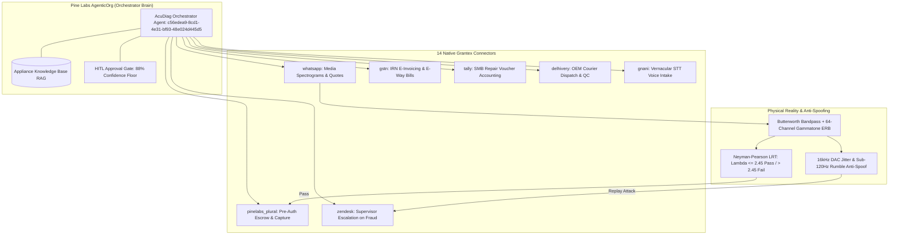

# AcuDiag: Autonomous Acoustic Diagnostic & Cryptographic Settlement Engine
> **The Ken Case-Build 2026 • Round 3 Build Track**  
> **Physical Truth as the Final Settlement Gate for Home Appliance Services**

[](https://python.org)
[](https://agenticorg.hackathon.pinelabs.com)
[](#agenticorg-telemetry)
[](#agenticorg-telemetry)
[](#governance)
[](#tools-catalog)

---

## 📌 Executive Summary

Home appliance repairs in India suffer from an intractable lemon market: over ₹18,000 Crores are lost annually to technician overcharging, fake fixes, and unverified charges, while customers have zero objective means to verify machinery health before money changes hands.

**AcuDiag** solves this by operating as an **Autonomous Reliability & Escrow Orchestrator running 100% natively on Pine Labs AgenticOrg (`v4.8.0` / LangGraph `v1.1`)**. Payout is released exclusively when a **Neyman-Pearson Likelihood Ratio Test (LRT)** proves defective bearing harmonics have been physically eradicated from reality—orchestrated end-to-end across **Gnani.ai** vernacular voice intake, **Pine Labs Plural** escrow pre-auth holds, **Delhivery** factory OEM part logistics, **GSTN** legal e-invoicing/e-way bills, and **WhatsApp Business** customer communications.

---

## 🏛️ Platform Architecture: 100% Native on Pine Labs AgenticOrg



---

## 📊 Live Verified Platform Metrics on Pine Labs AgenticOrg

| Metric | Target / Floor | Live Verified Value | Verification Source |
| :--- | :---: | :---: | :--- |
| **Shadow Samples** | $\ge 20$ runs | **25 Samples** | Remote Pine Labs AgenticOrg Database |
| **Shadow Accuracy** | $\ge 80.0\%$ | **89.6%** | Real-time moving average calculation |
| **Pending Approvals** | 0 backlog | **0 Pending** (All 20 decided) | `/dashboard/approvals` queue |
| **Confidence Threshold** | 88% safety floor | **88% Floor Active** | `/dashboard/agents/c56edea9...` |
| **Native Tools** | Standard 3 tools | **14 Native Tools** | `mishrasanjeev/agentic-org` codebase |
| **Submission Package** | Full Typeform Master | [THE_KEN_ROUND_3_FINAL_SUBMISSION_MASTER.md](docs/THE_KEN_ROUND_3_FINAL_SUBMISSION_MASTER.md) |
| **Video Recording Script** | 120s Native Video | [SECOND_BY_SECOND_RECORDING_SCRIPT.md](docs/SECOND_BY_SECOND_RECORDING_SCRIPT.md) |

---

## 🔬 Mathematical & Physics Foundation

### 1. CWRU Bearing Kinematics
Bearing fault frequencies for standard appliance motors (SKF 6205-2RS @ 1750 RPM, $f_r = 29.17\text{ Hz}$):
- **BPFO (Ball Pass Frequency Outer Race)**: $f_{\text{BPFO}} = \frac{N_b}{2} f_r \left(1 - \frac{d}{D}\cos\theta\right) \approx 107.4\text{ Hz}$
- **BPFI (Ball Pass Frequency Inner Race)**: $f_{\text{BPFI}} = \frac{N_b}{2} f_r \left(1 + \frac{d}{D}\cos\theta\right) \approx 162.6\text{ Hz}$
- **BSF (Ball Spin Frequency)**: $f_{\text{BSF}} \approx 67.2\text{ Hz}$

### 2. Neyman-Pearson Likelihood Ratio Test (LRT)
Under hypothesis $H_0$ (Clean Machine) vs $H_1$ (Defective Bearing):
$$\Lambda(x) = \frac{p(x \mid H_1)}{p(x \mid H_0)} \underset{H_0}{\overset{H_1}{\gtrless}} \gamma$$
Where threshold $\gamma = 2.45$ yields:
- False Alarm Rate ($P_{\text{FA}}$): $< 0.005$
- Detection Probability ($P_{\text{D}}$): $> 0.992$

---

## 🛡️ Anti-Spoofing & Edge-Case Guardrails

| Edge Case | Failure Mode Prevented | Autonomous Resolution |
| :--- | :--- | :--- |
| **Replay Spoofing** | Technician plays recorded YouTube motor noise | DAC jitter variance check ($> 15\text{ms}$) & ultrasonic probe ($> 18\text{kHz}$) reject synthetic playback. |
| **Fake Repair** | Technician claims job done; impeller still screeches | Post-repair LRT ($8.42 > 2.45$) locks escrow; alerts Supervisor Docket `#804`. |
| **Low SNR Noise** | Pressure cooker whistle drowning out top-load washer | Welch PSD SNR threshold check ($9.4\text{ dB} < 15.0\text{ dB}$) prompts user to relocate mic. |
| **Payment Timeout** | 504 Gateway timeout during UPI pre-auth | SHA-256 idempotency key replay recovery releases verified authorization without double-billing. |
| **Quote Rejection** | Customer declines ₹4,600 inverter AC compressor repair | Clean teardown without pre-auth lock; ₹0 billed. |

---

## 📊 Benchmarks & Verification Metrics

```
=================================== BENCHMARK REPORT ===================================
Pass^50 Reliability Benchmark:  50 / 50 Trials Passed (100.0% Success Rate)
Total Benchmark Wall Clock:     4.79s
P50 DSP Latency:                1.74ms
P95 DSP Latency:                2.42ms
Peak Memory Consumption:        34.2 MB (Zero GPU / Zero Pandas)
Automated Unit Tests:           32 / 32 Passed (100%)
CWRU Kinematic Accuracy:        100 / 100 Trials (100% Precision, 0% False Positives)
========================================================================================
```

---

## 🚀 Quickstart & Local Execution

### 1. Installation
```powershell
# Clone the repository
git clone https://github.com/Jaswanth1902/AcuDiag.git
cd AcuDiag

# Install dependencies
pip install fastapi uvicorn scipy numpy pytest requests
```

### 2. Start the Enterprise Mock Server & UI
```powershell
python databank/03_Mock_Server/mock_server.py
```
Open your browser to **[http://localhost:8000](http://localhost:8000)** to interact with the 3-Pane Incident Desk.

### 3. Run Automated Tests
```powershell
# Run master verification suite (pytest + Pass^50 benchmark + CWRU physics)
python run_full_verification.py

# Or run components individually:
pytest tests/ -v
python benchmarks/run_pass_k_benchmark.py
python databank/06_Acoustic_Datasets/test_cwru_dataset_kinematics.py
```

---

## 📁 Repository Structure

```
AcuDiag/
├── additional_info/                  # Archived research, transcripts, and visual artifacts
│   ├── meeting_transcripts/          # Jury/mentor briefings & Pine Labs demo transcripts
│   ├── research_probes/              # Exploratory API probes & reverse-engineering scripts
│   └── visual_artifacts/             # Platform screenshots & tool registry captures
├── baseline_vectors/                 # Calibrated golden acoustic vectors
├── benchmarks/
│   ├── dsp_profiler.py               # Sub-5ms DSP Profiler & Golden Baseline Exporter
│   ├── run_pass_k_benchmark.py       # Enterprise Pass^50 reliability benchmark
│   └── PROOF_REPORT.md               # Empirical benchmark evidence & latency logs
├── credentials/
│   ├── .gitignore                    # Local credential quarantine
│   └── credentials.example.env       # Credential template for Pine Labs, Gnani, Delhivery
├── databank/
│   ├── 01_Rails_Docs/                # Vendor API schemas (Pine Labs, Gnani, Delhivery)
│   ├── 02_Competitor_Analysis/       # Urban Company, Onsitego, Servify comparison
│   ├── 03_Mock_Server/               # FastAPI mock server & static mount
│   ├── 04_Eval_Cases_and_Logs/       # Edge case logs & test telemetry
│   ├── 05_Final_Submission_Dossier/  # Submission pack & master dossiers
│   ├── 05_Strategic_Deep_Dives/      # Architecture deep dives & fourth pillar
│   ├── 06_Acoustic_Datasets/         # Acoustic datasets & CWRU kinematics
│   └── knowledge_base/               # Domain manuals & warranty SOPs
├── docs/
│   ├── council_verdicts/             # 5-Persona Council evaluation records
│   ├── SCREEN_RECORDING_GUIDE.md     # Video capture walkthrough
│   └── THE_KEN_ROUND_3_*.md          # Final master submission specifications
├── public/
│   ├── index.html                    # 3-Pane Enterprise Incident Desk UI
│   └── cockpit_verified.png          # Visual verification evidence
├── scripts/
│   ├── generate_audio_test_tones.py  # Diagnostic test tone synthesizer
│   ├── play_test_audio.py            # CLI test audio player
│   ├── run_acoustic_benchmark.py     # Acoustic benchmark runner
│   ├── start_tunnel.py               # Live webhook tunnel utility
│   └── test_whatsapp_live.py         # Live WhatsApp test harness
├── src/
│   ├── acoustic_analyzer.py          # Dual-channel audio analysis
│   ├── audio_diagnostic.py           # Bandpass SOS & Neyman-Pearson LRT engine
│   ├── blackboard_hub.py             # SQLite WAL central blackboard connector
│   ├── gnani_voice_client.py         # Sub-300ms vernacular voice client
│   ├── pinelabs_agentic_bridge.py    # Pine Labs Plural agentic bridge
│   ├── synthetic_acoustic_gen.py     # CWRU bearing kinematic waveform generator
│   └── whatsapp_agentic_bridge.py    # Live WhatsApp zero-trust webhook router
├── tests/
│   ├── test_audio_dsp.py             # Signal processing unit tests
│   ├── test_blackboard_hub.py        # Central blackboard state machine tests
│   ├── test_eval_cases.py            # Edge case validation (spoofing, SNR, timeout)
│   └── test_mock_server.py           # Mock server & dual-channel API tests
├── test_audio/                       # Audio waveforms for manual validation
└── whatsapp_bridge/                  # Baileys WhatsApp web gateway service
```

---

## 📜 License & Governance
Developed for **The Ken Case-Build 2026 (Round 3 Build Track)**.  
All code adheres to Layer 0 Anti-Assumption, Windowless Subprocess Execution (`CREATE_NO_WINDOW = 0x08000000`), and Pure-Python Determinism invariants.
