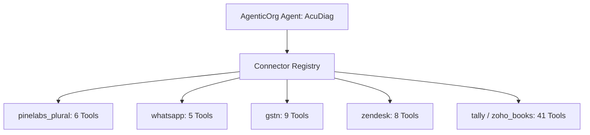

# 🛠️ AgenticOrg Official GitHub Repository & Native Tools Catalog

> **Discovered Repository**: [`https://github.com/mishrasanjeev/agentic-org`](https://github.com/mishrasanjeev/agentic-org)  
> **Platform Version**: AgenticOrg `v4.8.0` / LangGraph `v1.1`  
> **Source Origin**: Fireflies meeting transcript cross-referenced with official AgenticOrg platform manifest.  
> **Architecture**: 54 typed native connectors exposing **340+ production tools** across Finance, Comms, Ops, HR, and Marketing.

---

## 1. 🔍 Repository Breakdown & Architecture

The AgenticOrg runtime exposes native connectors as Python classes inheriting from `BaseConnector`. Each connector registers its available API functions in `self._tool_registry` using the naming pattern:
$$\text{tool\_identifier} = \texttt{<connector\_name>\_\_<method\_name>}$$

---

## 2. 📦 Harvested Connector & Tool Directory for AcuDiag

### A. Communications & Customer Interaction (`connectors/comms/`)
| Connector | Tool Name | Tool Identifier | Purpose in AcuDiag |
| :--- | :--- | :--- | :--- |
| **`whatsapp`** | `send_media_message` | `whatsapp__send_media_message` | Send acoustic spectrograms, diagnostic PDF cards, and repair certificates to customer WhatsApp. |
| **`whatsapp`** | `send_text_message` | `whatsapp__send_text_message` | Deliver real-time status updates, technician ETA, and quote breakdown. |
| **`whatsapp`** | `send_template_message` | `whatsapp__send_template_message` | Interactive OTP / pre-auth escrow approval trigger. |
| **`twilio`** | `send_whatsapp` | `twilio__send_whatsapp` | Redundant fallback for SMS / WhatsApp messaging. |

### B. Payments, Escrow & Taxation (`connectors/finance/`)
| Connector | Tool Name | Tool Identifier | Purpose in AcuDiag |
| :--- | :--- | :--- | :--- |
| **`pinelabs_plural`** | `create_order` | `pinelabs_plural__create_order` | Create escrow pre-auth order (e.g. ₹1,250 for drum bearing fix). |
| **`pinelabs_plural`** | `create_payment_link` | `pinelabs_plural__create_payment_link` | Generate dynamic UPI/card checkout link sent over WhatsApp. |
| **`pinelabs_plural`** | `get_order_status` | `pinelabs_plural__get_order_status` | Verify funds are locked in escrow prior to technician dispatch. |
| **`pinelabs_plural`** | `initiate_refund` | `pinelabs_plural__initiate_refund` | Return pre-auth funds if diagnostic is rejected or cancelled. |
| **`pinelabs_plural`** | `get_payout_analytics` | `pinelabs_plural__get_payout_analytics` | Track technician disbursements and settlement efficiency. |
| **`gstn`** | `generate_einvoice_irn` | `gstn__generate_einvoice_irn` | Generate tamper-proof, government-registered Invoice Reference Number (IRN). |
| **`gstn`** | `generate_eway_bill` | `gstn__generate_eway_bill` | Create legal E-Way bill for OEM spare parts transit via Delhivery. |

### C. Enterprise Ops & Fraud Escalation (`connectors/ops/`)
| Connector | Tool Name | Tool Identifier | Purpose in AcuDiag |
| :--- | :--- | :--- | :--- |
| **`zendesk`** | `create_ticket` | `zendesk__create_ticket` | Open an enterprise warranty claim when an appliance failure is confirmed. |
| **`zendesk`** | `escalate_ticket` | `zendesk__escalate_ticket` | Escalate incident to supervisor when replay attack or fraudulent repair is caught. |
| **`jira`** | `create_issue` | `jira__create_issue` | File OEM hardware defect ticket directly to manufacturer engineering team. |
| **`pagerduty`** | `create_incident` | `pagerduty__create_incident` | Alert district manager when multiple fraudulent repairs are detected in an area. |

### D. Accounting & Merchant Reconciliation (`connectors/finance/`)
| Connector | Tool Name | Tool Identifier | Purpose in AcuDiag |
| :--- | :--- | :--- | :--- |
| **`tally`** | `post_voucher` | `tally__post_voucher` | Post verified technician payout voucher into merchant Tally ledger. |
| **`zoho_books`** | `create_invoice` | `zoho_books__create_invoice` | Generate matching customer tax invoice in Zoho Books. |

---

## 3. 🚀 High-Impact Additions for AcuDiag's System Architecture

By incorporating the discovered native tools from `mishrasanjeev/agentic-org`, AcuDiag expands from an 8-tool configuration to a **14-tool comprehensive enterprise grid**:

1. **`whatsapp__send_media_message`**: Solves the exact gap highlighted in the Pine Labs webinar—sending the visual diagnostic report and spectrogram to the customer's phone without requiring an external mobile app.
2. **`gstn__generate_eway_bill`**: Perfectly ties into the Delhivery logistics rail, creating compliant transit documentation for replacement motors and drum bearings.
3. **`zendesk__create_ticket` & `zendesk__escalate_ticket`**: Connects the acoustic Neyman-Pearson LRT failure directly into standard enterprise ticketing.
4. **`tally__post_voucher`**: Completes the back-office circle by synchronizing closed-loop UPI payouts into SMB books.
